# ble2can

Kail uVision 5 Projekt. Zacetne nastavitve so bile ustavarjenje s programom STM32CubeMX.
Mikrokrmilnik, ki sem ga uporabil je Nucleo-F446RE. Je pa migracija na ostale mikrokrmilnike zelo enostavna.
uVision projekt se nahaja v mapi MDK-ARM.

Prikaz delovanja:
<iframe width="660" height="371" src="https://www.youtube.com/embed/PXILkQ6B3jg" title="YouTube video player" frameborder="0" allow="accelerometer; autoplay; clipboard-write; encrypted-media; gyroscope; picture-in-picture" allowfullscreen></iframe>

Električna shema:
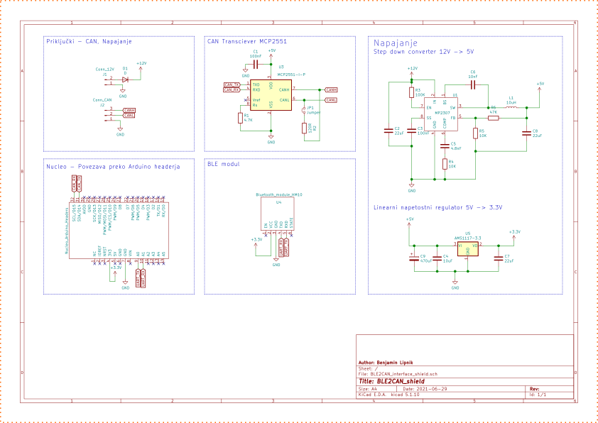

Slike CAN paketov za vsak ukaz:

ukaz: sdo_r_e 1,0x1005,0
Request:
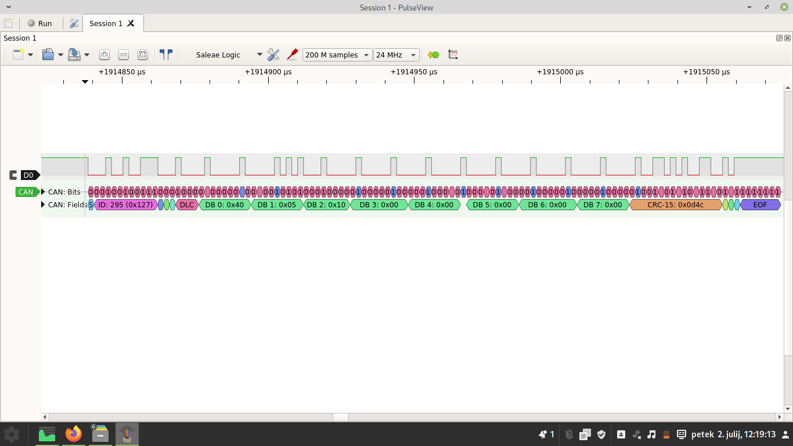
Responose:
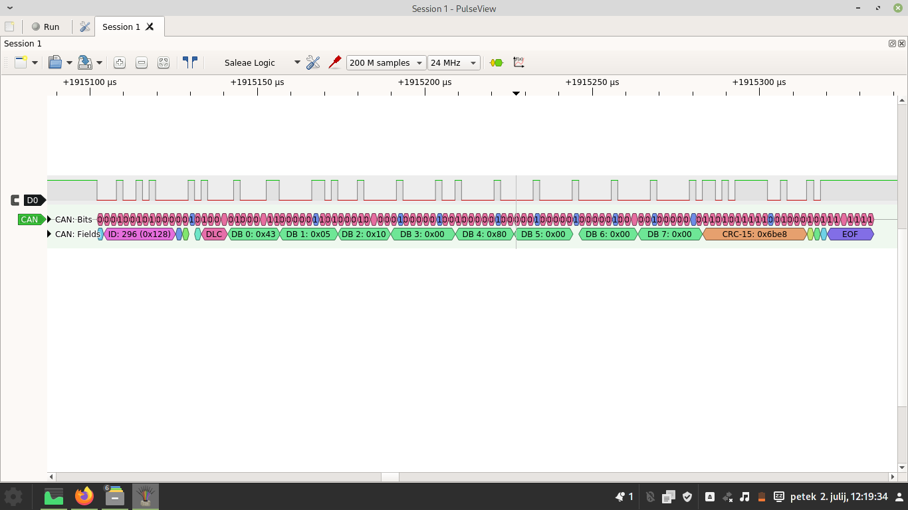

ukaz: sdo_w_e 1,0x1005,0,4,0x11223344
Request:
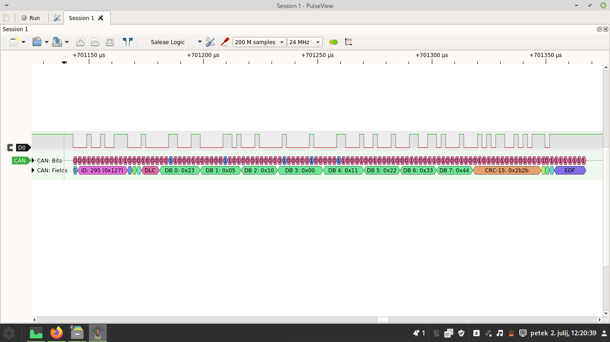
Response:
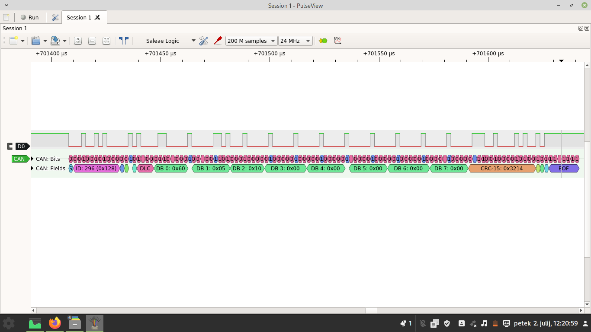

ukaz: sdo_w_s 1,0x100a,0,5
Request:
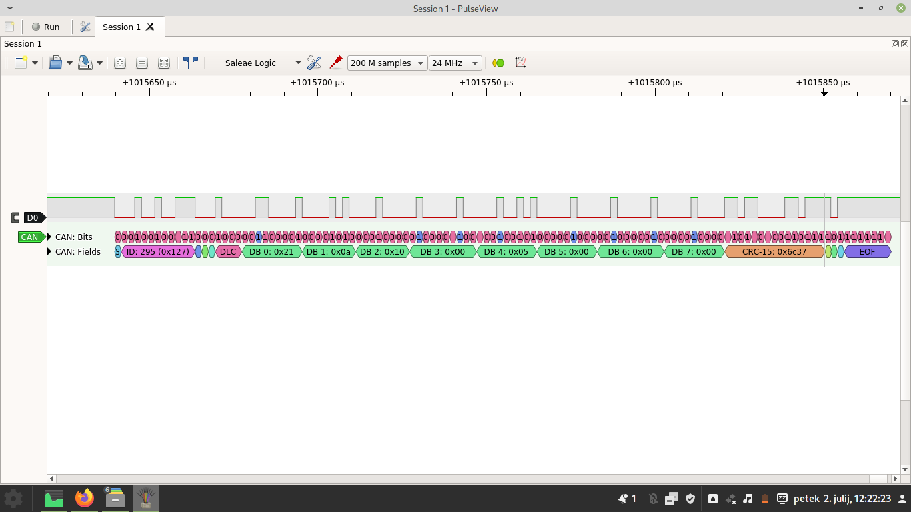
Response:
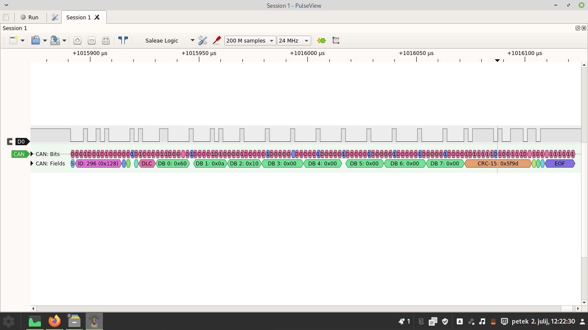

->ukaz sdo_d_w 5,0xaabbccddee
Request:
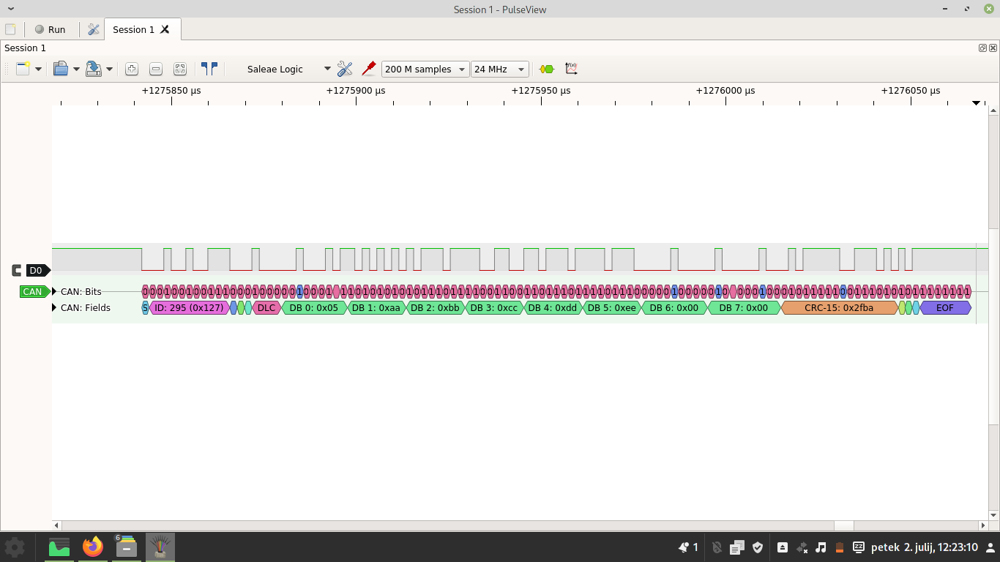
Response:
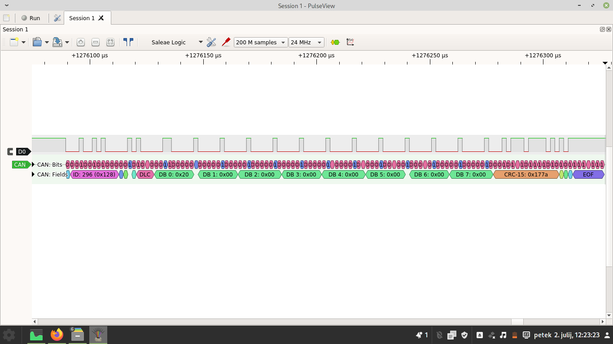

ukaz: sdo_r 1,0x100a,0
Request:
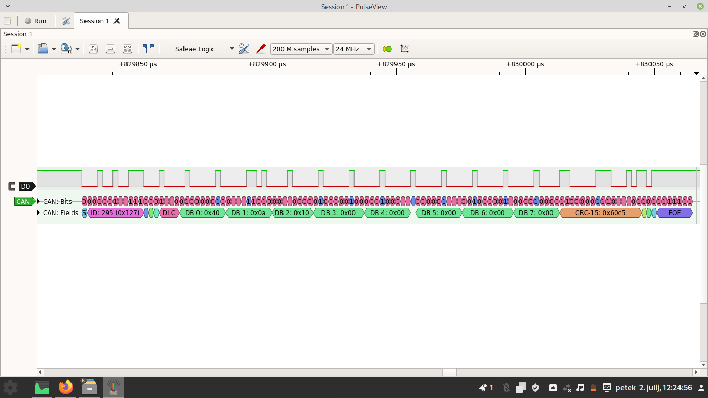
Response:
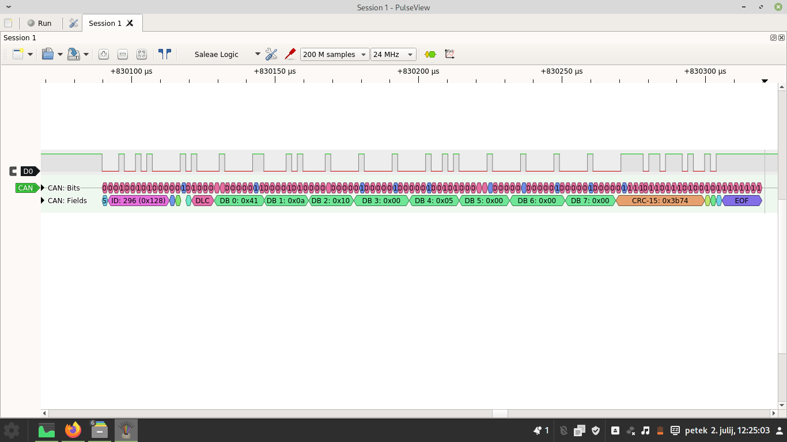

->ukaz: sdo_d_r
Request:
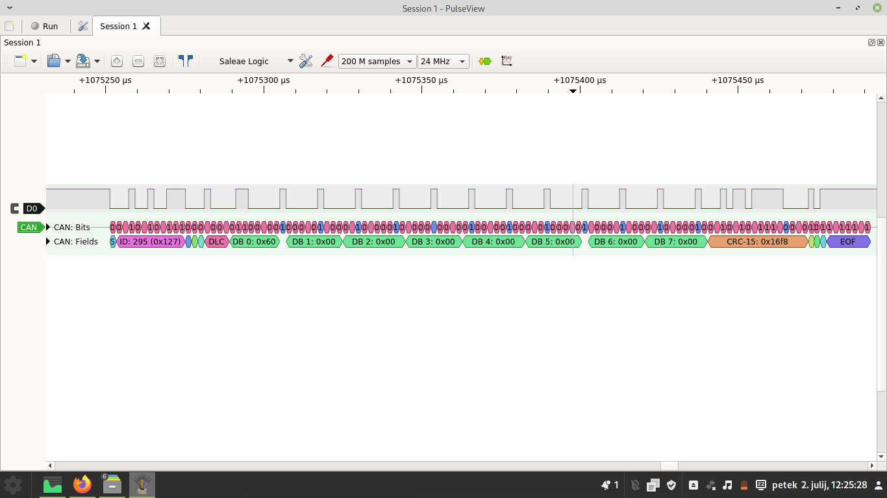
Response:
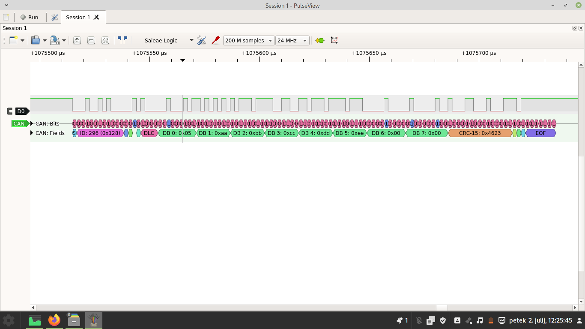

